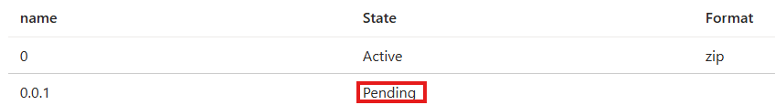

# How to create an Azure Batch's Application Package automatically
While using Azure Batch, you may need to create an application package to run your applications in the cloud. 

The creation can be done manually, generating and uploading a `.zip` file to the Azure Batch resource Portal. However, this process can be tedious and time-consuming, especially if you have multiple applications or need to update the package frequently, for instance at every new release (or hotfix!).

In this post we will cover how to automate the creation of an Azure Batch application package using a Python script.

<!-- more -->

## Prerequisites
### Things you should know
- Basic knowledge of Python and Azure Batch
- What is an [Application Package](https://learn.microsoft.com/en-us/azure/batch/batch-application-packages)
### Packages
The following packages are required:
```
pip install azure-identity azure-mgmt-batch azure-storage-blob
```

## Steps

The script will:
1. Create a new version of the application package (and a new application if it does not exist).
1. Zip the needed files
1. Upload the zip file to Azure Blob Storage
1. Activate the new version of the application package


## Step by step

**NOTE**: For the sake of simplicity, we will use the AzureDefaultCredential, which uses the Azure CLI credentials. You can use any other authentication method supported by the Azure SDK for Python.

All the configuration parameters are stored in environment variables. You can set them in your terminal or use a `.env` file with the `python-dotenv` package.


### 1. Create a new version of the application package

```python
from azure.identity import DefaultAzureCredential
from azure.mgmt.batch import BatchManagementClient

client = BatchManagementClient(
        credential=DefaultAzureCredential(),
        subscription_id=os.getenv("SUBSCRIPTION_ID"),
    )

response = client.application_package.create(
    resource_group_name=os.getenv("RESOURCE_GROUP_NAME"),
    account_name=os.getenv("BATCH_ACCOUNT_NAME"),
    application_name=os.getenv("APPLICATION_NAME"),
    version_name=os.getenv("VERSION_NAME"),
)
if response.state == "Active":
    raise Exception("Application package is already active. Please provide a new version name.")

elif response.state == "Pending":
    ...
```
On the Batch portal, in `Features/Applications` you will see something like this:

### 2. Zip the needed files

```python
from tempfile import TemporaryDirectory
from os.path import isdir, join
import shutil

...
elif response.state == "Pending":
    with TemporaryDirectory() as temp_dir:
        for file in needed_files:
            path = join(BASE_DIR, file)
            if isdir(path):
                shutil.copytree(path, join(temp_dir, file))
            else:
                shutil.copy(path, temp_dir)

        tmp_path = join(temp_dir, os.getenv("VERSION_NAME"))
        shutil.make_archive(tmp_path, "zip", root_dir=temp_dir)
        ...
```

The needed files (a list of files path to be added to the archive) are defined above in the script.


### 3. Upload the zip file to Azure Blob Storage
The `response` object of step 1 contains the URL of the blob storage where the application package will be uploaded. We can use the `azure-storage-blob` package to upload the zip file to the blob storage.

```python
from azure.storage.blob import BlobClient

    ...
    blob_client = BlobClient.from_blob_url(response.storage_url)
    with open(tmp_path + ".zip", "rb") as data:
        blob_client.upload_blob(data, overwrite=True)
```

### 4. Activate the new version of the application package

After uploading the zip file, we need to activate the new version of the application package. We can do this by calling the `activate` method of the `BatchManagementClient` class.

```python
client.application_package.activate(
    resource_group_name=os.getenv("RESOURCE_GROUP_NAME"),
    account_name=os.getenv("BATCH_ACCOUNT_NAME"),
    application_name=os.getenv("APPLICATION_NAME"),
    version_name=os.getenv("VERSION_NAME"),
    parameters={"format": "zip"},
)
```

The application package is now active and ready to be used in your Azure Batch jobs.

<details>
<summary>Complete code</summary>

```python
from azure.identity import DefaultAzureCredential
from azure.mgmt.batch import BatchManagementClient
from azure.storage.blob import BlobClient
import os
from os.path import isdir, join
import shutil  
from tempfile import TemporaryDirectory


needed_files = [
    "setup.py
    "setup.cfg",
    "code" # this is a folder
]

client = BatchManagementClient(
        credential=DefaultAzureCredential(),
        subscription_id=os.getenv("SUBSCRIPTION_ID"),
    )

response = client.application_package.create(
    resource_group_name=os.getenv("RESOURCE_GROUP_NAME"),
    account_name=os.getenv("BATCH_ACCOUNT_NAME"),
    application_name=os.getenv("APPLICATION_NAME"),
    version_name=os.getenv("VERSION_NAME"),
)
if response.state == "Active":
    raise Exception("Application package is already active. Please provide a new version name.")

elif response.state == "Pending":

    with TemporaryDirectory() as temp_dir:
        for file in needed_files:
            path = join(BASE_DIR, file)
            if isdir(path):
                shutil.copytree(path, join(temp_dir, file))
            else:
                shutil.copy(path, temp_dir)

        
        tmp_path = join(temp_dir, os.getenv("VERSION_NAME"))
        shutil.make_archive(os.getenv("VERSION_NAME"), "zip", root_dir=temp_dir)

        blob_client = BlobClient.from_blob_url(response.storage_url)
        with open(tmp_path + ".zip", "rb") as data:
            blob_client.upload_blob(data, overwrite=True)

client.application_package.activate(
    resource_group_name=os.getenv("RESOURCE_GROUP_NAME"),
    account_name=os.getenv("BATCH_ACCOUNT_NAME"),
    application_name=os.getenv("APPLICATION_NAME"),
    version_name=os.getenv("VERSION_NAME"),
    parameters={"format": "zip"},
)

```

</details>