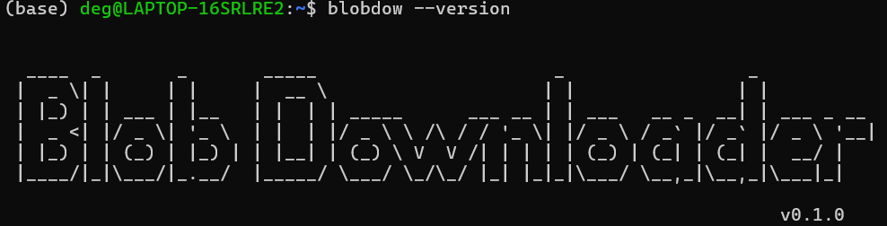
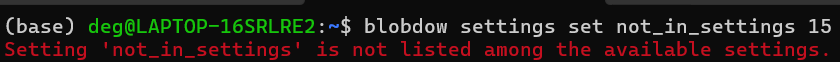
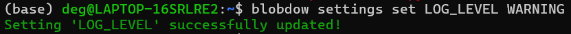
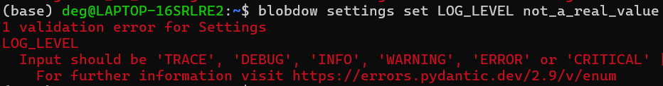
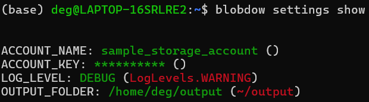

# Create a Comand line interface in few minutes

{ width=800 }

A command line interface could seem an ancient tool to all non expert users, nowadays used to fancy click and drop user interfaces. Nothing more wrong! It is also a valid tool to enhance your libraries and projects, reusable in bash scripts and ci/cd pipelines.

In this tutorial we will deep dive into the python [click](https://click.palletsprojects.com/en/8.1.x/) library and create a simple command line interface (CLI) to manage the settings value and interact with our project.

<!-- more -->

!!! info "Where is the code?"
    You can find the working code shown in this tutorial [in this folder](https://github.com/DeGiorgiMarcello/degs-notes/tree/master/code_examples/command-line-interface-with-click).

## Installation
The installation is straightforward. In a virtual environment with pip installed, simply run:

```
pip install click
```

## A CLI example

When thinking to a CLI we usually think to one or multiple entry points that allow to perform *multiple* actions. For instance, when typing `git`, a long list of possible commands are shown:

```cmd
git
usage: git [-v | --version] [-h | --help] [-C <path>] [-c <name>=<value>]
           [--exec-path[=<path>]] [--html-path] [--man-path] [--info-path]
           [-p | --paginate | -P | --no-pager] [--no-replace-objects] [--bare]
           [--git-dir=<path>] [--work-tree=<path>] [--namespace=<name>]
           [--super-prefix=<path>] [--config-env=<name>=<envvar>]
           <command> [<args>]

These are common Git commands used in various situations:

start a working area (see also: git help tutorial)
   clone     Clone a repository into a new directory
   init      Create an empty Git repository or reinitialize an existing one

work on the current change (see also: git help everyday)
   add       Add file contents to the index
   mv        Move or rename a file, a directory, or a symlink
   restore   Restore working tree files
   rm        Remove files from the working tree and from the index

...
```

Each of these command accepts arguments and options, or could also represent a group of subcommands. Usually, each command has a `--help` options and a short help message that explains that a specific command requires and does.

## Create a CLI to manage the settings

In [this article](./manage-settings-with-pydantic.md) we have seen how to create a Settings class to set and validate settings values. Among the possible way a value can be changed is using environment variables stored in a `.env` files. Let's create a CLI to visualize the current settings and to manage them.

### Group of commands
As said, a CLI can be composed by a group of commands.

Let's create a first group of commands, named **cli**. This will be used later as entry point. To create a group, simply import *click* and use it's `@click.group` decorator on a function.

```python
import click

@click.group()
def cli():
    ...
```
Using an ellipse (`...`) in the body function, or a `pass` is sufficient: the aim of this function is simply to group other commands. Instead of an empty body we could add an explanation on what our CLI is supposed to do. 

In this example we will manage settings, but it is quite probable that a more complex CLI would be also used to execute other tasks. Let's create a group of commands that will collect a series of subcommand for the settings management. They will be in charge of:

- visualize the current settings (*show*)
- set a value (*set*)
- unset a value (*unset*)

```python
@click.group()
def cli():
    ...

@click.group()
def settings():
    """Groups of commands for settings management"""

@settings.command(name="set", help="Set a setting value")
def _set():
    ...

@settings.command(help="Show the current values")
def show():
    ...

@settings.command(help="Unset a setting value")
def unset():
    ...

cli.add_command(settings)
```
There are few attention points here:


- The **settings** group command has been linked to the **cli** group command using `cli.add_command(settings)`. 
- To link the *set*, *unset* and *show* commands we have instead used the `@settings.command` decorator.
- As you can see we cannot have the `set` function, since it would overwrite the python *set* keyword. In this case it is sufficient to specify a name in the `@settings.command()` decorator.
- A short help has been added to all the commands


### Define an entry point
Before to continue specializing our cli commands, let's connect this python script to our project.

To do so it is mandatory that our project has a configuration file that allows our project to be packaged, installed and distributed: you can use a `setup.cfg`, a `setup.py` or a `pyproject.toml` as well.

In our example we are going to use *setup.cfg* for the configuration and *setup.py* to allow `pip` to install our project. The configuration file will contain all the metadata, the required (and optional) dependencies and also the `entry_points`. The entry points are used to link functions, modules and other element of your project to other libraries (in this way it is possible to create a plugins system, more on this extremely good [article](https://amir.rachum.com/python-entry-points/) from Amir Rachum). In our case we will use the entry point to simply link the `cli` group to the project.

From now on let's give a proper *direction* to our fake project: we will create a **BlobDownloader**, with a settings system and a CLI to manage the settings and download some blob objects.

This is its `setup.cfg` file:

```setup title="setup.cfg"
[metadata]
name = blob_downloader
version = 0.1.0
author = Marcello De Giorgi
author_email = degiorgimarcello@gmail.com
description = A simple blob downloader
long_description = file: README.md
long_description_content_type = text/markdown

[options]
packages = find:
python_requires = >=3.6

install_requires =
    azure-storage-blob==12.22.*
    pydantic-settings==2.1.*
    click==8.1.*

[options.entry_points]
console_scripts =
    blobdow = blob_downloader.cli:cli
```

Let's ignore everything and just concentrate on the last 3 rows:

```
[options.entry_points]
console_scripts =
    blobdow = blob_downloader.cli:cli
```

We are basically giving a name to access our cli (*blob_downloader* was too long!). The `blob_downloader.cli:cli` is basically the dot-notation path to our `cli.py` file, in the `blob_downloader` package (it is a package because it has a `__init__.py` file). In particular, we are retrieving the `cli` function (the main command group!).

Once the entry point has been added to the `setup.cfg`, we can proceed installing (better if in **editable mode**) the *BlobDownloader*.

```pip install -e .```

If everything has been installed correctly, typing `blobdow`in the terminal will pop up this:
```
> blobdow
Usage: blobdow [OPTIONS] COMMAND [ARGS]...

Options:
  --help  Show this message and exit.

Commands:
  settings  Groups of commands for settings management
```

and `blobdow settings` this:

```
> blobdow settings
Usage: blobdow settings [OPTIONS] COMMAND [ARGS]...

  Groups of commands for settings management

Options:
  --help  Show this message and exit.

Commands:
  set    Set a setting value
  show   Show the current values
  unset  Unset a setting value
```

### Add arguments and options to commands
Let's now start to define our commands. First of all, let's add a `--version` command. This value can be automatically inferred by *click* passing the name of the package from which the installed version will be taken. 

This is added directly to the `cli` group command. The `message` argument is completely optional but it always funny to give to our CLI a personalized flavour. 

```
@click.version_option(package_name="blob_downloader", message=logo)
@click.group()
def cli(): ...
```

Typing `blobdow --version` results in:

```
> blobdow --version

  ____  _       _       _____                      _                 _
 |  _ \| |     | |     |  __ \                    | |               | |
 | |_) | | ___ | |__   | |  | | _____      ___ __ | | ___   __ _  __| | ___ _ __
 |  _ <| |/ _ \| '_ \  | |  | |/ _ \ \ /\ / / '_ \| |/ _ \ / _` |/ _` |/ _ \ '__|
 | |_) | | (_) | |_) | | |__| | (_) \ V  V /| | | | | (_) | (_| | (_| |  __/ |
 |____/|_|\___/|_.__/  |_____/ \___/ \_/\_/ |_| |_|_|\___/ \__,_|\__,_|\___|_|

                                                                        v0.1.0
```

#### Settings set
As we have seen in [this article](./manage-settings-with-pydantic.md), the settings can be set via environment variables. Any changes that we will do to our settings must last also when the cli command ends its execution. Therefore, we must store any settings change in the `.env` file. 


```python
@settings.command(name="set", help="Set a setting value")
@click.argument("name", type=str)
@click.argument("value")
def _set(name, value):
    if name in S.model_fields:
        try:
            S.model_validate({name: value})
        except Exception as e:
            click.secho(e, fg="red")
            click.get_current_context().exit(2)
        else:
            update_settings_file(name, value)
            click.secho(f"Setting '{name}' successfully updated!", fg="green")
    else:
        click.secho(f"Setting '{name}' is not listed among the available settings.", fg="red")
        click.get_current_context().exit(2)
```

Let's go over line by line:

- Two `@click.commands` have been added. The first one is the name and must be of type `str` (this is not the best example on where to use the `type` option, since all the input parameters will be always string. Different would have been if the type would have been `int`, since a cast would have been then executed for validation purposes.) The second one is the **value** to be set. 
    
    *click* will now suggest a new usage: 

    ```Usage: blobdow settings set [OPTIONS] NAME VALUE```

- The commands need to be also in the function argument.
- We first check that the `name` is listed among the settings. If this is not the case, a `click.secho` message in red will be printed.

    

- If the name is listed in the settings, we use **pydantic** to validate it. 

- If the validation is ok, we update the `.env` file
    

- otherwise an exception is raised and printed in red.

    

#### Settings unset
The *unset* is quite similar to the *set*. 

```python
@settings.command(help="Unset a setting value")
@click.argument("name", type=str)
def unset(name):
    env_path = S.model_config.get("env_file")
    if name in S.model_fields:
        if name in dotenv_values(env_path):
            unset_key(env_path, name)
        click.secho(f"Setting '{name}' unset successfully.", fg="green")
    else:
        click.secho(f"Setting '{name}' does not exists.", fg="red")
```

Let's now add the option `--all` to restore to the default value all the settings all at once.
To do so, we just need to remove the `.env` file. This can be done in different ways: let's use a *callback*. 

##### Options' callbacks
Callbacks allow to alter the execution flow defined in the command body: this can be quite usefule in some cases, expecially when associated with the command `is_eager=True`, that ignore all the other options and arguments and execute the callback first!

```python
def remove_env_file(ctx, param, value):
    """Remove the env file"""
    if not value or ctx.resilient_parsing:
        return
    if click.confirm("Are you sure you want to delete the .env file?", abort=True):
        env_path = S.model_config.get("env_file")
        if env_path and exists(env_path):
            remove(env_path)
            click.secho(f"File .env ({env_path}) removed correctly.")
        ctx.exit(0)
...
@click.option("-a", "--all", is_flag=True, callback=remove_env_file,  help="Restore all the settings")
def unset(name):
    ...
```

A lot of stuff here! Let's start from the end. The *option* decorator accepts as input a short and a long name (you are not force to define them all). The `is_flag` specifies that the option does not require any value after and that it's own presence is equals to the value `True`. The `callback` argument is the function defined above.

The Callback signature requires the current context `ctx`, the command `params` and the `value` of the option. The following block is a common pattern in the click callbacks:

```python
if not value or ctx.resilient_parsing:
    return
```
It is used to prevent the callback execution in those cases in which click parses the command (*resilient parsing*): if you try to remove it, you will notice that the callback will be executed even if the `--all` option is not passed.

The `click.confirm` function returns a prompt (y/n) to the user, quite useful in a lot of situations.

##### A simpler solution
Use a callback for our purpose has been like shooting a mosquito with a bazooka. Callbacks are usually used for validating or transforming the input parameters before to continue with the command body. We could have achieved the same purpose using an `if/else` statement.

```python
@settings.command(help="Unset a setting value")
@click.argument("name", type=str)
@click.option("-a", "--all", is_flag=True, help="Restore all the settings")
def unset(name, all):
    if all:
        # remove the .env file and quit
        ...
    env_path = S.model_config.get("env_file")
    if name in S.model_fields:
        if name in dotenv_values(env_path):
            unset_key(env_path, name)
        click.secho(f"Setting '{name}' unset successfully.", fg="green")
    else:
        click.secho(f"Setting '{name}' does not exists.", fg="red")
```

#### Settings show
The `settings` command does not requires special arguments or options. We just need to print the settings names, the values and (optionally) the default ones.


```python
@settings.command(help="Show the current values")
def show():
    click.echo("\n")
    for name, values in S.model_fields.items():
        default = values.default
        click.echo(f"{name}: ", nl=False)
        click.secho(getattr(S,name),fg="green", nl=False)
        click.echo(" (", nl=False)
        click.secho(f"{default}", fg="red", nl=False)
        click.echo(")")

    click.echo("\n")
```

`blobdow settings show` results in:



## Conclusion
In this article we have seen only the peak of the iceberg of this wonderful library. In few lines of code we have been able to create a simple but effective and quite useful command line interface to manage the settings of our project. We still need to test that everything works properly, but that will be a subject for another article!

## Sources

- <https://click.palletsprojects.com/en/8.1.x/>
- <https://amir.rachum.com/python-entry-points/>
- <https://click.palletsprojects.com/en/stable/arguments/>
- <https://click.palletsprojects.com/en/stable/options/>